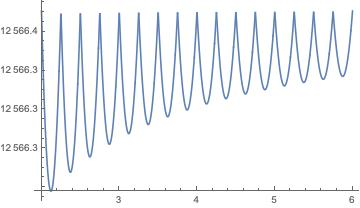

# Hard cutoff

We put in a high-frequency cutoff $$\Lambda$$ so that $$\omega < \pi \Lambda$$. Then the highest mode

$$
n_{\rm max} (r) = \Lambda r~.
$$

Therefore,

$$
E(r) = \frac1r \frac\pi2 \sum_{n = 1}^{n_{\rm max}} n = \frac{\pi }{4r} (\Lambda r) (\Lambda r + 1) = \frac{\pi}{4}(\Lambda^2 r + \Lambda)~.
$$

Then

$$
E_{\rm tot} = E(L-a) + E(a) = \frac\pi 4 (\Lambda^2 L + 2 \Lambda)~.
$$


Surprisingly, the total energy is independent of $$a$$, so the force vanishes. This result is only correct to leading order.


We should have

$$
n_{\rm max} (r) = \lfloor \Lambda r\rfloor~,
$$

Then the sum is

$$
E(r) = \frac{\pi}{4} \lfloor \Lambda r \rfloor (\lfloor \Lambda r \rfloor + 1)~.
$$

Now the total energy oscillates with $$a$$ as

To deal with this oscillation, define a number $$x$$ as

$$
x = \Lambda a - \lfloor \Lambda a \rfloor \in [0, 1)~,
$$

which gives

$$
E(a) = \frac{\pi}{4}\left[ \Lambda^2 a + \Lambda - 2\Lambda x - \frac{x(1-x)}{a}\right]~.
$$

We will also take $$\Lambda L$$ to be an integer. Then $$\lfloor \Lambda L - \Lambda a \rfloor = \Lambda L - \lceil \Lambda a \rceil$$. For simplicity, let us also assume $$\Lambda a$$ is not an integer, which lets us use $$\lceil \Lambda a \rceil = \lfloor \Lambda a \rfloor +1$$. Then,

$$
\begin{align}
E(L-a) &= \frac{\pi}{4} \left[ \frac{(\Lambda L - \lceil \Lambda a \rceil)(\Lambda L - \lceil \Lambda a \rceil + 1)}{L-a}\right]\\
&= \frac \pi 4 \left[\Lambda^2 (L-a) -\Lambda + 2\Lambda x - \frac{x(1-x)}{L-a}\right]
\end{align}
$$

and

$$
E_{\rm tot} = E(L-a) + E(a) = \frac \pi 4 \left[ \Lambda^2 L - \frac{x(1-x)}{a} - \frac{x(1-x)}{L-a}\right]
$$

When $$L$$ is very large, we can drop the third term. When $$\Lambda \to \infty$$, we can average $$x$$ between 0 and 1, using $$\int x(1-x) = \frac16$$ . So,

$$
E_{\rm tot}(a) \approx \frac \pi 4 L \Lambda^2 - \frac{\pi}{24 a}~.
$$

The force in one dimension is now

$$
F(a) = - \frac{\pi}{24 a^2} \hbar c~,
$$

where we have put back $$\hbar$$ and $$c$$.

